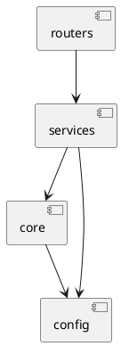

# PyTestArch — Architectural Import Rules Guide

This guide covers how to define and enforce architectural import rules using [PyTestArch](https://github.com/zyskarch/pytestarch) (`pytestarch` on PyPI). It is written for this project's microservice layout but the patterns apply to any Python codebase.

---

## Table of Contents

1. [Why Architectural Tests](#1-why-architectural-tests)
2. [Install](#2-install)
3. [How It Works](#3-how-it-works)
4. [Building the Evaluable](#4-building-the-evaluable)
5. [Module-Level Rules (`Rule`)](#5-module-level-rules-rule)
6. [Layer-Level Rules (`LayerRule`)](#6-layer-level-rules-layerrule)
7. [PlantUML Diagram Rules (`DiagramRule`)](#7-plantuml-diagram-rules-diagramrule)
8. [Applying to This Project](#8-applying-to-this-project)
9. [CI Integration](#9-ci-integration)
10. [Best Practices](#10-best-practices)
11. [Antipatterns](#11-antipatterns)
12. [Performance](#12-performance)
13. [Known Limitations](#13-known-limitations)
14. [Alternatives](#14-alternatives)
15. [API Quick Reference](#15-api-quick-reference)

---

## 1. Why Architectural Tests

Architecture rules exist in docs and team agreements. Without enforcement, they erode one import at a time. Architectural tests make boundaries machine-checked:

- A router imports business logic directly instead of going through the service layer — **caught in CI**.
- A new developer adds a FastAPI dependency inside a pure-Python service module — **caught in CI**.
- Config code reaches into core state — **caught in CI**.

Architectural tests are fitness functions: they measure how well the codebase conforms to its intended structure. They run as regular pytest tests and fail with clear messages pointing to the offending import.

---

## 2. Install

Add `pytestarch` as a dev dependency in the service's `pyproject.toml`:

```toml
[project.optional-dependencies]
dev = [
    # ... existing dev deps ...
    "pytestarch>=4.0.0",
]
```

Then run `uv sync --all-extras` from the service directory.

For dependency graph visualization (optional):

```toml
    "pytestarch[visualization]>=4.0.0",
```

---

## 3. How It Works

PyTestArch operates in three steps:

1. **Scan** — `get_evaluable_architecture()` walks a directory, parses every `.py` file's AST, and builds a NetworkX graph of module imports. This produces an `EvaluableArchitecture` object.

2. **Define** — You write rules using a fluent API (`Rule`, `LayerRule`, or `DiagramRule`) that express constraints like "module A should not import module B".

3. **Assert** — `rule.assert_applies(evaluable)` checks the rule against the import graph. Violations raise `AssertionError` with a message identifying the offending modules.

```
┌─────────────┐     ┌──────────────┐     ┌─────────────┐
│  Filesystem  │────▶│  Evaluable   │◀────│    Rules     │
│  (src/*.py)  │     │  (graph)     │     │  (fluent)    │
└─────────────┘     └──────┬───────┘     └─────────────┘
                           │
                    assert_applies()
                           │
                    ┌──────▼───────┐
                    │  Pass / Fail  │
                    └──────────────┘
```

---

## 4. Building the Evaluable

### Session-Scoped Fixture

Scanning the filesystem is expensive. Build the evaluable once per test session.

```python
# tests/architecture/conftest.py
import os
import pytest
from pytestarch import get_evaluable_architecture, EvaluableArchitecture


@pytest.fixture(scope="session")
def evaluable() -> EvaluableArchitecture:
    """Build an in-memory representation of the service's import graph."""
    # Adjust paths relative to test file location
    project_root = os.path.dirname(os.path.dirname(os.path.dirname(__file__)))
    src_dir = os.path.join(project_root, "src")
    return get_evaluable_architecture(project_root, src_dir)
```

### Full Signature

```python
get_evaluable_architecture(
    root_path: str | Path,           # Project root (distinguishes internal vs external)
    module_path: str | Path,         # Directory to scan for Python modules
    exclusions: tuple[str, ...],     # Pseudo-regex patterns to skip files/dirs
    exclude_external_libraries: bool = True,  # Ignore third-party imports
    level_limit: int | None = None,  # Max graph depth (None = unlimited)
    regex_exclusions: tuple[str, ...] | None = None,
    external_exclusions: tuple[str, ...] | None = None,
    regex_external_exclusions: tuple[str, ...] | None = None,
) -> EvaluableArchitecture
```

**Key parameters:**

| Parameter | When to Use |
|---|---|
| `exclusions` | Skip directories like `__pycache__`, `migrations` |
| `exclude_external_libraries` | Set `False` only if you need rules about third-party imports |
| `level_limit` | Limit depth for large codebases (performance) |
| `external_exclusions` | Exclude specific external packages by name |

### Alternative: From Module Objects

If modules are already imported in your test environment:

```python
from pytestarch import get_evaluable_architecture_for_module_objects
import identity_service

evaluable = get_evaluable_architecture_for_module_objects(
    identity_service,
    # ... same optional params
)
```

---

## 5. Module-Level Rules (`Rule`)

### Grammar

A module rule follows this structure:

```
Rule()
  .modules_that().<subject_matcher>
  .<behavior>
  .<dependency_type>
  .<object_matcher>        # (unless using import_anything/be_imported_by_anything)
  .assert_applies(evaluable)
```

### Subject and Object Matchers

After `modules_that()`, or after a dependency type method, use one of:

| Matcher | Description |
|---|---|
| `.are_named("pkg.module")` | Exact module name (submodules count as part of it) |
| `.are_named(["a", "b"])` | Match multiple modules |
| `.are_sub_modules_of("pkg")` | All submodules, **excluding** the parent itself |
| `.have_name_matching(r"regex")` | Fully qualified name matches regex |

**Deprecated:** `.have_name_containing("substring")` — use `.have_name_matching()` instead.

### Behavior

| Method | Meaning |
|---|---|
| `.should()` | Must have at least one such relationship |
| `.should_not()` | Must have zero such relationships |
| `.should_only()` | Must have this relationship AND no other (exclusive) |

### Dependency Types

| Method | Direction | Needs Object? |
|---|---|---|
| `.import_modules_that()` | Subject imports Object | Yes |
| `.be_imported_by_modules_that()` | Subject is imported by Object | Yes |
| `.import_modules_except_modules_that()` | Subject imports anything except Object | Yes |
| `.be_imported_by_modules_except_modules_that()` | Subject is imported by anything except Object | Yes |
| `.import_anything()` | Subject has any outgoing imports | No |
| `.be_imported_by_anything()` | Subject has any incoming imports | No |

### Examples

**Domain must not import infrastructure:**

```python
def test_domain_does_not_depend_on_infrastructure(evaluable):
    (
        Rule()
        .modules_that()
        .are_sub_modules_of("identity_service.services")
        .should_not()
        .import_modules_that()
        .are_sub_modules_of("identity_service.routers")
        .assert_applies(evaluable)
    )
```

**Only routers may import schemas:**

```python
def test_only_routers_import_schemas(evaluable):
    (
        Rule()
        .modules_that()
        .are_named("identity_service.schemas")
        .should_only()
        .be_imported_by_modules_that()
        .are_sub_modules_of("identity_service.routers")
        .assert_applies(evaluable)
    )
```

**Value objects have no outgoing imports:**

```python
def test_value_objects_are_leaf_modules(evaluable):
    (
        Rule()
        .modules_that()
        .have_name_matching(r".*value_object.*")
        .should_not()
        .import_anything()
        .assert_applies(evaluable)
    )
```

---

## 6. Layer-Level Rules (`LayerRule`)

For layered architectures, writing individual module rules gets verbose. `LayerRule` lets you reason at the layer level.

### Define Layers Once

```python
# tests/architecture/conftest.py
from pytestarch import LayeredArchitecture

@pytest.fixture(scope="session")
def layered_arch() -> LayeredArchitecture:
    return (
        LayeredArchitecture()
        .layer("routers").containing_modules(["identity_service.routers"])
        .layer("services").containing_modules(["identity_service.services"])
        .layer("core").containing_modules(["identity_service.core"])
        .layer("config").containing_modules(["identity_service.config"])
    )
```

Notes:
- A layer groups one or more modules. All submodules belong to the same layer.
- Not every module needs a layer. Unlayered modules are still tracked.
- Layer names are arbitrary strings.

### Layer Rule Grammar

```
LayerRule()
  .based_on(architecture)
  .layers_that()
  .are_named("layer_name" | ["layer_a", "layer_b"])
  .<behavior>                      # should / should_not / should_only
  .access_layers_that()            # or be_accessed_by_layers_that()
  .are_named("other_layer")
  .assert_applies(evaluable)
```

Terminal shortcuts (no object needed):
- `.access_any_layer()`
- `.be_accessed_by_any_layer()`

### Examples

**Routers must not skip to core:**

```python
def test_routers_do_not_access_core_directly(evaluable, layered_arch):
    (
        LayerRule()
        .based_on(layered_arch)
        .layers_that()
        .are_named("routers")
        .should_not()
        .access_layers_that()
        .are_named("core")
        .assert_applies(evaluable)
    )
```

**Services layer only accesses core and config:**

```python
def test_services_only_access_core_and_config(evaluable, layered_arch):
    (
        LayerRule()
        .based_on(layered_arch)
        .layers_that()
        .are_named("services")
        .should_only()
        .access_layers_that()
        .are_named(["core", "config"])
        .assert_applies(evaluable)
    )
```

### Difference from Module Rules

| Aspect | `Rule` | `LayerRule` |
|---|---|---|
| Subject/Object | Module names, regex | Layer names only |
| Verb | `import_modules_that` | `access_layers_that` |
| Granularity | Individual module | Group of modules |
| Satisfaction | Every matched module must comply | At least one module in source layer must have the relationship |

---

## 7. PlantUML Diagram Rules (`DiagramRule`)

If you maintain a PlantUML component diagram, `DiagramRule` generates rules from it.

### Diagram Format



Requirements:
- Components in square brackets: `[name]`
- Arrows: `-->`, `->`, `<--`, `<-`, `-text->`
- Arrow heads point to the dependency (what gets imported)
- Parent-child relationships are NOT supported

### Usage

```python
from pathlib import Path
from pytestarch import DiagramRule

def test_architecture_matches_diagram(evaluable):
    rule = DiagramRule(should_only_rule=True)
    rule.from_file(Path("docs/architecture.puml"))
    rule.with_base_module("identity_service")
    rule.assert_applies(evaluable)
```

- `should_only_rule=True` — edges mean "should only import" (strict)
- `should_only_rule=False` — edges mean "should import" (permissive)

---

## 8. Applying to This Project

### Service Layout Recap

Each service follows this structure:

```
services/<service-dir>/src/<service_name>/
    __init__.py
    app.py                    # FastAPI factory — wires everything
    config.py                 # Pydantic settings
    logging.py                # Logging wrapper
    schemas.py                # Request/response models
    routers/                  # Thin HTTP handlers
        health.py
        <domain>.py
    core/                     # Infrastructure glue
        state.py              # AppState singleton
        lifespan.py           # Startup/shutdown
        exceptions.py         # Error handlers
    services/                 # Pure business logic
        <domain>.py
```

### Architectural Rules for This Project

These rules encode the design principles from `CLAUDE.md`:

**Rule 1: Business logic must not import FastAPI.**
The `services/` layer is pure Python. No framework dependencies.

```python
def test_service_layer_does_not_import_fastapi(evaluable):
    (
        Rule()
        .modules_that()
        .are_sub_modules_of("identity_service.services")
        .should_not()
        .import_modules_that()
        .have_name_matching(r"fastapi.*")
        .assert_applies(evaluable)
    )
```

**Rule 2: Routers are thin — they must not import other routers.**

```python
def test_routers_do_not_import_each_other(evaluable):
    (
        Rule()
        .modules_that()
        .are_sub_modules_of("identity_service.routers")
        .should_not()
        .import_modules_that()
        .are_sub_modules_of("identity_service.routers")
        .assert_applies(evaluable)
    )
```

**Rule 3: Schemas are data definitions — they must not import service logic.**

```python
def test_schemas_do_not_import_services(evaluable):
    (
        Rule()
        .modules_that()
        .are_named("identity_service.schemas")
        .should_not()
        .import_modules_that()
        .are_sub_modules_of("identity_service.services")
        .assert_applies(evaluable)
    )
```

**Rule 4: Config must be self-contained — no imports from core or services.**

```python
def test_config_does_not_import_core_or_services(evaluable):
    (
        Rule()
        .modules_that()
        .are_named("identity_service.config")
        .should_not()
        .import_modules_that()
        .are_sub_modules_of("identity_service.core")
        .assert_applies(evaluable)
    )

def test_config_does_not_import_services(evaluable):
    (
        Rule()
        .modules_that()
        .are_named("identity_service.config")
        .should_not()
        .import_modules_that()
        .are_sub_modules_of("identity_service.services")
        .assert_applies(evaluable)
    )
```

**Rule 5: Core state must not import routers.**

```python
def test_core_does_not_import_routers(evaluable):
    (
        Rule()
        .modules_that()
        .are_sub_modules_of("identity_service.core")
        .should_not()
        .import_modules_that()
        .are_sub_modules_of("identity_service.routers")
        .assert_applies(evaluable)
    )
```

### Canary Test (Always Include This)

This test verifies the evaluable actually scans the codebase. Without it, misconfigured paths cause all rules to silently pass.

```python
def test_evaluable_detects_known_import(evaluable):
    """Verify the evaluable is scanning our code — not silently empty."""
    (
        Rule()
        .modules_that()
        .are_named("identity_service.app")
        .should()
        .import_modules_that()
        .are_named("identity_service.config")
        .assert_applies(evaluable)
    )
```

### Suggested File Layout

```
services/identity/
    tests/
        architecture/
            __init__.py
            conftest.py              # evaluable + layered_arch fixtures
            test_canary.py           # canary test (evaluable health check)
            test_layer_boundaries.py # layer boundary rules
            test_module_rules.py     # module-specific rules
```

### Pytest Marker

Mark architecture tests with a custom marker for selective execution:

```python
# In each test file
import pytest

pytestmark = pytest.mark.architecture
```

Register the marker in `conftest.py` or `pyproject.toml`:

```toml
# pyproject.toml
[tool.pytest.ini_options]
markers = [
    "architecture: architectural boundary tests",
]
```

Run selectively: `uv run pytest tests/architecture/ -m architecture`

---

## 9. CI Integration

### Separate CI Step

Architecture tests are slower than unit tests (filesystem scanning) and serve a different purpose. Run them separately:

```bash
# In the justfile, add:
code-architecture:
    uv run pytest tests/architecture/ -v --tb=long -x
```

**Flags:**
- `-v` — verbose, shows each rule by name
- `--tb=long` — full tracebacks; violation messages are the most useful output
- `-x` — fail fast; architecture violations rarely come alone

### In GitHub Actions

```yaml
- name: Architecture tests
  run: |
    cd services/identity
    uv run pytest tests/architecture/ -v --tb=long -x
```

### Do NOT Put in Pre-Commit

The filesystem scan takes 2-10 seconds depending on codebase size. This is acceptable for CI but too slow for pre-commit hooks. Keep architectural tests in CI only.

---

## 10. Best Practices

### Start Small, Expand Incrementally

Begin with one or two high-value rules:
1. "Business logic must not import frameworks" (the most universally useful rule)
2. "No layer skipping" (routers must go through services)

Verify they work, fix violations, then add more rules. A test suite of 5-10 well-chosen rules catches more drift than 50 micro-rules.

### One Test Function Per Invariant

Each test should express exactly one architectural constraint. Name it after the rule it enforces:

```python
def test_services_do_not_import_fastapi(evaluable): ...
def test_routers_do_not_import_each_other(evaluable): ...
def test_config_is_self_contained(evaluable): ...
```

These double as living documentation of the architecture.

### Use Parametrize for Repeated Patterns

When the same rule applies to multiple modules:

```python
@pytest.mark.parametrize("service_module", [
    "identity_service",
    "central_bank_service",
    "reputation_service",
])
def test_services_layer_is_framework_free(evaluable, service_module):
    (
        Rule()
        .modules_that()
        .are_sub_modules_of(f"{service_module}.services")
        .should_not()
        .import_modules_that()
        .have_name_matching(r"fastapi.*")
        .assert_applies(evaluable)
    )
```

### Always Include a Canary Test

The canary test asserts a known-true import exists. If the canary fails, the evaluable is misconfigured and all other tests are meaningless. See [Section 8](#applying-to-this-project) for the example.

### Use Fully Qualified Module Names

Module names in rules must match how PyTestArch resolves them from your `root_path` and `module_path`. For a `src/` layout with `module_path` pointing at `src/`:

```python
# If module_path = "services/identity/src"
# The module is: identity_service.services.identity

# CORRECT
Rule().modules_that().are_named("identity_service.services.identity")

# WRONG (will silently match nothing)
Rule().modules_that().are_named("services.identity")
```

### Use Architecture Tests as Refactoring Goals

Write rules for your **target** architecture before restructuring. Mark them with `pytest.mark.xfail` while violations still exist:

```python
@pytest.mark.xfail(reason="Legacy coupling: tracked in ARCH-42")
def test_no_circular_imports_between_services(evaluable):
    ...
```

As you refactor, tests start passing. Remove the `xfail` markers as violations are resolved. This gives measurable refactoring progress.

---

## 11. Antipatterns

### Antipattern 1: Silent Pass Due to Wrong Module Paths

**The single most dangerous mistake.** If module paths in rules do not match how PyTestArch resolves them, rules silently pass with zero modules checked. Everything looks green, nothing is enforced.

```python
# WRONG — silently passes because no modules match
Rule().modules_that().are_named("myapp.domain")

# CORRECT — matches how pytestarch resolves from root_path
Rule().modules_that().are_named("identity_service.services")
```

**Fix:** Always include a canary test (see Best Practices).

### Antipattern 2: Overly Strict Rules

Testing every possible import combination creates brittle tests that break on any refactoring:

```python
# BAD — breaks every time internal wiring changes
def test_module_a_imports_exactly_b_and_c(evaluable):
    Rule().modules_that().are_named("myapp.a")
        .should_only()
        .import_modules_that()
        .are_named(["myapp.b", "myapp.c"])  # Fragile!
        .assert_applies(evaluable)
```

**Fix:** Test boundaries ("must not cross"), not wiring ("must import exactly these"). As [pytest-archon's author warns](https://bargsten.org/wissen/how-to-tame-your-python-codebase/): "Please don't overdo it. This is just a crash barrier!"

### Antipattern 3: `should_only()` Surprises

`should_only()` enforces both "no other imports" AND "at least one import exists." It fails if:
- The source module imports something outside the allowed set (expected)
- The source module does not import the allowed target at all (surprising)

```python
# This FAILS if api does not currently import services
Rule().modules_that().are_sub_modules_of("myapp.api")
    .should_only()
    .import_modules_that()
    .are_sub_modules_of("myapp.services")
    .assert_applies(evaluable)
```

**Fix:** Use `should_not()` for boundaries (what to block) and reserve `should_only()` for relationships you know exist.

### Antipattern 4: Not Testing the Tests

Architecture rules that pass against a broken scan provide false confidence. Without a canary test, you can have a full green suite that checks nothing.

**Fix:** The canary test (a positive `should()` assertion on a known import) must be the first test in the suite.

### Antipattern 5: Ignoring `TYPE_CHECKING` Blocks

```python
from __future__ import annotations
from typing import TYPE_CHECKING

if TYPE_CHECKING:
    from identity_service.core.state import AppState  # Invisible to pytestarch
```

PyTestArch performs static AST analysis. It does not evaluate runtime conditions. Imports inside `if TYPE_CHECKING:` blocks are not detected.

**Fix:** Accept this limitation or use `pytest-archon` which has a `skip_type_checking` flag. Document which imports are intentionally in `TYPE_CHECKING` blocks and why.

### Antipattern 6: Testing Implementation Details

```python
# BAD — breaks whenever internal wiring changes
def test_health_router_imports_state(evaluable):
    Rule().modules_that().are_named("myapp.routers.health")
        .should().import_modules_that().are_named("myapp.core.state")
        .assert_applies(evaluable)
```

This test asserts HOW health checks work, not WHAT constraints apply. It breaks whenever you refactor the health endpoint internals.

**Fix:** Test constraints, not wiring: "routers must not import services directly" rather than "health router must import state."

### Antipattern 7: No Baseline for Legacy Code

Introducing architectural tests to an existing codebase with many violations produces hundreds of failures. PyTestArch has no equivalent to ArchUnit's `FreezingArchRule`.

**Fix:** Use `pytest.mark.xfail` with a reason and tracking issue:

```python
@pytest.mark.xfail(reason="Legacy: 23 violations, tracked in ARCH-42")
def test_no_cross_layer_imports(evaluable):
    ...
```

Or introduce rules incrementally: start with rules that already pass, then add stretch-goal rules as `xfail`.

---

## 12. Performance

### Scanning Costs

`get_evaluable_architecture()` walks the filesystem, parses every `.py` file's AST, and builds a NetworkX directed graph. Typical costs:

| Codebase Size | Scan Time |
|---|---|
| <100 files | <1 second |
| 100-500 files | 1-5 seconds |
| 500-2000 files | 5-15 seconds |

### Mitigation

1. **Session-scoped fixture** — scan once per test run (not per test)
2. **`exclusions`** — skip irrelevant directories:
   ```python
   get_evaluable_architecture(
       root, src,
       exclusions=("**/tests/**", "**/migrations/**", "**/__pycache__/**"),
   )
   ```
3. **`level_limit`** — cap graph depth when you only care about top-level boundaries
4. **`exclude_external_libraries=True`** (default) — keep the graph small
5. **Separate CI step** — architecture tests are inherently slower than unit tests; run them as a parallel CI job

---

## 13. Known Limitations

| Limitation | Impact | Workaround |
|---|---|---|
| Bare `import X` not caught by `are_named()` ([#145](https://github.com/zyskarch/pytestarch/issues/145)) | Rules may miss `import module` style imports (only catches `from X import Y`) | Verify with canary tests |
| No function-level imports ([#72](https://github.com/zyskarch/pytestarch/issues/72)) | Lazy imports inside functions are invisible | Accept or use `pytest-archon` |
| `TYPE_CHECKING` blocks invisible | Imports guarded by `if TYPE_CHECKING:` are not scanned | Accept; these are type-only |
| No transitive import checking | A module violating rules through an intermediary is not caught | Write rules at each boundary |
| Dynamic imports invisible | `importlib.import_module()`, `__import__()` not detected | By design (static AST only) |
| `external_exclusions` + `exclude_external_libraries=False` can crash ([#132](https://github.com/zyskarch/pytestarch/issues/132)) | `NetworkXError` in some configurations | Keep `exclude_external_libraries=True` or test carefully |

### Version Requirements

- Python >= 3.9 (tested through 3.13)
- PyTestArch >= 4.0.0 (current: 4.0.1)

---

## 14. Alternatives

If PyTestArch does not fit your needs, these tools solve similar problems with different tradeoffs:

| Tool | Approach | Key Strength | Key Weakness |
|---|---|---|---|
| [**pytestarch**](https://github.com/zyskarch/pytestarch) | Pytest + fluent API | Layer rules, PlantUML support | No transitive checks, no `TYPE_CHECKING` awareness |
| [**pytest-archon**](https://github.com/jwbargsten/pytest-archon) | Pytest + fluent API | `skip_type_checking`, transitive checks, custom predicates | No built-in layer abstraction |
| [**import-linter**](https://github.com/seddonym/import-linter) | Config file + CLI | Baseline/ignore support, most mature | Not pytest-native |
| [**deply**](https://github.com/Vashkatsi/deply) | YAML config + CLI | Checks decorators and inheritance, not just imports | Less community adoption |

**When to use what:**
- **PyTestArch** — you want layer-level reasoning or PlantUML-driven tests
- **pytest-archon** — you need fine-grained control (`TYPE_CHECKING`, transitive, custom predicates)
- **import-linter** — large legacy codebase with many existing violations (baseline support)
- **deply** — Django/Flask projects where decorators define component roles

---

## 15. API Quick Reference

### Public Exports

```python
from pytestarch import (
    get_evaluable_architecture,               # Build evaluable from filesystem
    get_evaluable_architecture_for_module_objects,  # Build from imported modules
    EvaluableArchitecture,                    # Type hint for fixtures
    Rule,                                      # Module-level rules
    LayerRule,                                 # Layer-level rules
    LayeredArchitecture,                       # Layer definitions
    DiagramRule,                               # PlantUML rules
)
```

### Rule Fluent Chain

```
Rule()
  .modules_that()
    .are_named("pkg.mod")              # exact match
    .are_sub_modules_of("pkg")         # submodules only
    .have_name_matching(r"regex")      # regex match
  .should()                            # must have relationship
  .should_not()                        # must not have relationship
  .should_only()                       # exclusive relationship
    .import_modules_that()             # outgoing imports
    .be_imported_by_modules_that()     # incoming imports
    .import_modules_except_modules_that()
    .be_imported_by_modules_except_modules_that()
    .import_anything()                 # terminal (no object)
    .be_imported_by_anything()         # terminal (no object)
      .<object_matcher>                # same as subject matchers
  .assert_applies(evaluable)           # execute
```

### LayerRule Fluent Chain

```
LayerRule()
  .based_on(architecture)
  .layers_that()
    .are_named("layer" | ["a", "b"])
  .should() / .should_not() / .should_only()
    .access_layers_that()
    .be_accessed_by_layers_that()
    .access_any_layer()                # terminal
    .be_accessed_by_any_layer()        # terminal
      .are_named("layer" | ["a", "b"])
  .assert_applies(evaluable)
```

---

## References

- [PyTestArch GitHub](https://github.com/zyskarch/pytestarch)
- [PyTestArch Documentation](https://zyskarch.github.io/pytestarch/latest/)
- [PyTestArch PyPI](https://pypi.org/project/PyTestArch/)
- [Protecting Architecture with Automated Tests in Python](https://handsonarchitects.com/blog/2026/protecting-architecture-with-automated-tests-in-python/)
- [pytest-archon: How to Tame Your Python Codebase](https://bargsten.org/wissen/how-to-tame-your-python-codebase/)
- [import-linter: 6 Ways to Improve Architecture](https://www.piglei.com/articles/en-6-ways-to-improve-the-arch-of-you-py-project/)
